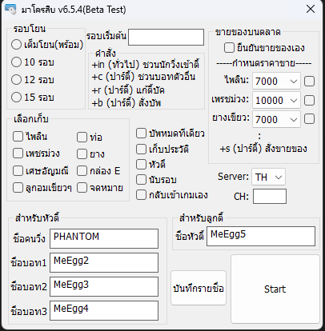

# bot-raycity

 *ปัจจุบันโดนแก้แล้วไม่สามารถใช้ได้ เอาไว้สำหรับศึกษาต่อ
 
ความสามารถ
    - รับของเอง (เลือกรับได้)
    - โยนของเองเมื่อของเต็ม
    - สั่งให้บอทบัพได้
    - สั่งตั้งขายของตลาดได้
    - ชวนปาร์ตี้ / ออกปาร์ตี้ได้
    - บันทึกรายชื่อสมาชิกปาร์ตี้
    - รองรับ channel TH, CN, KR, EN
    - เก็บประวัติการวิ่ง
    - นับรอบ
    - กลับเข้าเกมเอง

